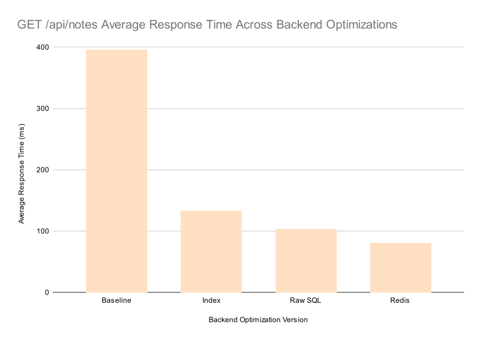

# FastNotes

  
  <h2 align="center"><a href="https://fastnotes.ink">fastnotes.ink</a></h2>
  
A backend-first note-taking API and web app focused on low-latency access, efficient queries, and scalable design.

## Summary

- Engineered a high-performance note-taking API and web app to study database and caching performance under load
- Seeded database with 100k notes and conducted sustained load testing with Locust (20 concurrent users, 5-minute runs)
- Reduced average GET /notes latency from 396ms to 81ms (~5× speedup) and p95 from 560ms to 170ms through database indexing, raw SQL optimization, and Redis caching

## Backend Performance Benchmarking

To better understand real-world backend performance bottlenecks, I conducted a series of controlled benchmarks on the `GET /api/notes` endpoint. The goal was to iteratively optimize query performance and measure the impact of common backend improvements such as indexing, query optimization, and caching.

### Benchmark Setup

The database was seeded with 100,000 notes to simulate a production-scale workload. Each benchmark version was tested using Locust with the following configuration:

- 20 concurrent users
- 5 minute sustained load test
- Each user repeatedly requested `GET /api/notes`
- Latency metrics were saved as CSVs in `backend/benchmark/versions/`

Each optimization was introduced incrementally so that the performance impact of each change could be isolated and measured.

### Optimization Versions

The following version labels are used on the x-axis of the benchmark results chart.

<table align="center">
  <thead>
    <tr>
      <th>Version Label</th>
      <th>Description</th>
    </tr>
  </thead>
  <tbody>
    <tr>
      <td><strong>Baseline</strong></td>
      <td>Initial implementation using ORM queries without indexing or caching</td>
    </tr>
    <tr>
      <td><strong>Index</strong></td>
      <td>Added a database index on <code>user_id</code> in the Notes table</td>
    </tr>
    <tr>
      <td><strong>Raw SQL</strong></td>
      <td>Replaced ORM query with raw SQL to reduce query overhead</td>
    </tr>
    <tr>
      <td><strong>Redis</strong></td>
      <td>Added Redis caching to store and quickly retrieve a user's notes</td>
    </tr>
  </tbody>
</table>

### Benchmark Results

The following chart summarizes the average response time improvements across each optimization stage.

